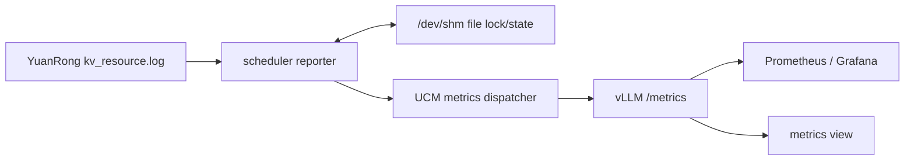

# UCM YuanRong 分层命中率与容量可观测性设计

> 状态：已按确认需求实现，待评审。

## 1. 目标

本设计为以下 Store pipeline 增加可观测性：

- `YuanRong|Posix`：展示 HBM、YuanRong DRAM、YuanRong SSD、Posix Store 对总请求 token 的命中率贡献。
- `Cache|Posix`：使用同一统计口径，展示 HBM、Cache、Posix Store 对总请求 token 的命中率贡献。
- 展示 YuanRong DRAM、YuanRong SSD 和 Posix Store 的已用容量、总容量及水位。
- 指标同时可用于 Grafana dashboard 和 UCM metrics view 工具。

命中率的最终口径统一为：

```text
某层命中率 = 该层命中 token 数 / 总请求 token 数
```

UCM Store 内部不重复计算 token 数，而是用 vLLM 的 token 级外存命中率乘以 UCM 的 shard 加载来源比例，将外存命中 token 分配到各层。当前每个 UCM shard 大小固定，所以 TP/DP 只会等比例放大来源计数的分子和分母，不需要配置 TP 数量。

## 2. 当前实现确认

### 2.1 YuanRong 加载粒度

- 一个 UCM shard 对应一个 YuanRong key/object。
- 一次 UCM `Load` 可以包含多个 shard，YuanRong 和 Posix 的来源归属按 shard 统计。
- `YuanRong|Posix` 的 Load 路径为：
  1. `Exist` 将 shard 分为 YuanRong hit 和 lookup miss。
  2. hit shard 执行 `MGetH2D`/`AsyncMGetH2D`。
  3. lookup miss shard直接从 Posix 加载。
  4. `Exist` 命中但 `MGetH2D` 失败的 raced miss shard 回退到 Posix。

### 2.2 YuanRong 资源日志

`kv_resource.log` 是 JSON Lines 文件，默认每 10 秒追加一个 `resource_snapshot`，并会按 YuanRong 日志策略轮转。需要的字段为：

```text
metrics.oc_hit_num.mem_hit_num
metrics.oc_hit_num.disk_hit_num
metrics.oc_hit_num.l2_hit_num
metrics.oc_hit_num.remote_hit_num

metrics.shared_memory.physical_memory_usage
metrics.shared_memory.total_limit
metrics.spill_hard_disk.physical_space_usage
metrics.spill_hard_disk.total_limit
```

其中容量字段的单位是 byte；hit 字段是 YuanRong worker 进程启动后的累计 key Get 次数。

### 2.3 Posix 容量

Posix GC 已经按目录 shard 采样文件数，并使用 `posix_capacity_gb`、`block_size` 计算 GC 阈值。因此可以在 GC 的采样周期内同时上报：

```text
estimated_file_count = avg_files_per_directory_shard * directory_shard_count
used_bytes           = estimated_file_count * block_size
capacity_bytes       = posix_capacity_gb * GiB
usage_ratio          = used_bytes / capacity_bytes
```

这里的 `used_bytes` 是 Store 逻辑占用估算值，不是文件系统 `statvfs` 的整盘物理占用。

## 3. 新增原始 Metrics

所有 `*_total` 都是 Counter；容量、水位和状态为 Gauge。命中率本身不在 UCM 热路径固化为 Gauge，而是在查询窗口内通过 Counter 的 `rate()` 计算。

### 3.1 YuanRong|Posix 加载来源

| Metric | 含义 |
| --- | --- |
| `yuanrong_load_success_shards_total` | 最终由 YuanRong 成功加载到 Device 的 shard 数 |
| `yuanrong_lookup_miss_posix_load_success_shards_total` | YuanRong lookup miss 后，由 Posix 成功加载到 Device 的 shard 数 |
| `yuanrong_load_fallback_posix_load_success_shards_total` | lookup 命中但 YuanRong 实际加载失败，回退 Posix 并成功加载到 Device 的 shard 数 |
| `yuanrong_load_failed_shards_total` | YuanRong 和 Posix 均未能完成加载的 shard 数，诊断指标，不参与当前分层比例公式 |

`Exist` 本身异常时，代码会进入 `MGetH2D-first` 路径。此时 `MGetH2D` 成功的 shard 计入 YuanRong；失败后由 Posix 成功恢复的 shard 计入 `yuanrong_load_fallback_posix_load_success_shards_total`。

成功边界定义为：

- YuanRong：`MGetH2D` 返回后不在 `failedList` 中。
- Posix：`Posix Wait`、Host-to-Device copy 和 stream synchronize 全部成功。
- 一个 recovery batch 内任一 copy/sync 失败时，该 batch 不计入 Posix success，计入 failed。

### 3.2 Cache|Posix 加载来源

| Metric | 含义 |
| --- | --- |
| `cache_load_success_shards_total` | 最终由已有 Cache buffer 成功加载到 Device 的 shard 数 |
| `cache_posix_load_success_shards_total` | Cache 未就绪，经 Posix 填充后成功加载到 Device 的 shard 数 |
| `cache_load_failed_shards_total` | Cache/Posix 未能完成加载的 shard 数 |

现有 `cache_load_backend_shards_total` 统计的是实际提交 backend 的 owner shard。在共享 buffer/多 TP 场景下，非 owner 会等待同一个 backend load，因此不能直接作为所有 TP 的 Posix 来源数，也不应在 PromQL 中乘 TP 数。

新计数需要在每个 shard 完成 H2D 后按其初始来源打点：

- dispatch 时 buffer 已 ready：Cache。
- dispatch 时 buffer 未 ready，无论本进程是否 owner：Posix。
- H2D batch 同步成功后才批量增加对应 success Counter。

### 3.3 从 YuanRong 日志转发的命中计数

| Metric | 来源 |
| --- | --- |
| `yuanrong_local_dram_load_hits_total` | `mem_hit_num` 的相邻快照增量 |
| `yuanrong_remote_load_hits_total` | `remote_hit_num` 的相邻快照增量 |
| `yuanrong_local_ssd_load_hits_total` | `disk_hit_num` 的相邻快照增量 |
| `yuanrong_l2_load_hits_total` | `l2_hit_num` 的相邻快照增量，仅用于诊断 |

日志中是 YuanRong 的绝对累计值；UCM reporter 需要保存上一快照并只向 UCM Counter 增加差值。检测到 YuanRong 重启导致计数回退时，以当前值作为新进程的增量起点。

`l2_hit_num` 表示本地内存、本地 spill disk 和远端 worker 均未成功提供对象后，从 YuanRong L2 持久化存储读取成功的次数。L2 当前包括 OBS、SFS 和 distributed disk，不是本地 spill SSD。UCM YuanRong Dump 使用 `WriteMode::NONE_L2_CACHE_EVICT`，不会为 UCM 对象写入 L2 副本；在本设计约定的独占部署中该值应保持为 0，非零视为部署或流量范围异常。

### 3.4 容量和水位

| Metric | 类型 | 来源 |
| --- | --- | --- |
| `yuanrong_dram_used_bytes` | Gauge | `shared_memory.physical_memory_usage` |
| `yuanrong_dram_capacity_bytes` | Gauge | `shared_memory.total_limit` |
| `yuanrong_dram_usage_ratio` | Gauge | DRAM used / capacity |
| `yuanrong_ssd_used_bytes` | Gauge | `spill_hard_disk.physical_space_usage` |
| `yuanrong_ssd_capacity_bytes` | Gauge | `spill_hard_disk.total_limit` |
| `yuanrong_ssd_usage_ratio` | Gauge | SSD used / capacity |
| `posix_store_used_bytes` | Gauge | Posix GC 采样得到的逻辑占用估算值 |
| `posix_store_capacity_bytes` | Gauge | `posix_capacity_gb` |
| `posix_store_usage_ratio` | Gauge | Posix used / capacity |

同时增加采集健康指标：

| Metric | 类型 | 含义 |
| --- | --- | --- |
| `yuanrong_resource_log_read_errors_total` | Counter | 打开、读取或解析日志失败次数 |
| `yuanrong_resource_log_last_update_timestamp_seconds` | Gauge | 最新快照中 `time` 字段对应的时间 |
| `yuanrong_resource_log_reporter_leader` | Gauge | 当前进程是否为本机 reporter leader |

## 4. 命中率计算

以下值都先在相同 Prometheus 时间窗口内对目标 model/engine 的 Counter 求 `rate()`，再跨 worker 求和。不能先算每个 worker 的比例再平均。

### 4.1 HBM 与外存总命中率

```text
H_hbm = rate(vllm:prefix_cache_hits_total)
        / rate(vllm:prefix_cache_queries_total)

H_external_conditional = rate(vllm:external_prefix_cache_hits_total)
                         / rate(vllm:external_prefix_cache_queries_total)

H_external = H_external_conditional * (1 - H_hbm)
```

`H_external` 是 YuanRong/Cache/Posix 对全部请求 token 的总命中贡献。

### 4.2 YuanRong 总命中率与 Posix 命中率

```text
Y = rate(yuanrong_load_success_shards_total)

P = rate(yuanrong_lookup_miss_posix_load_success_shards_total)
  + rate(yuanrong_load_fallback_posix_load_success_shards_total)

H_yuanrong_total = H_external * Y / (Y + P)
H_posix           = H_external * P / (Y + P)
```

因此：

```text
H_yuanrong_total + H_posix = H_external
```

### 4.3 YuanRong DRAM 与 SSD 命中率

根据当前部署约束，remote SSD 加载会直接失败，成功的 `remote_hit_num` 全部按远端 DRAM 处理：

```text
D = rate(yuanrong_local_dram_load_hits_total)
  + rate(yuanrong_remote_load_hits_total)

S = rate(yuanrong_local_ssd_load_hits_total)

H_yuanrong_dram = H_yuanrong_total * D / (D + S)
H_yuanrong_ssd  = H_yuanrong_total * S / (D + S)
```

`l2_hit_num` 不参与 DRAM/SSD 分配。Dashboard 和 metrics view 单独保留其 rate 作为诊断值；一旦非零，需要检查 YuanRong `l2_cache_type`、对象 write mode 及是否存在约定范围外的 client。

最终应满足：

```text
H_hbm + H_yuanrong_dram + H_yuanrong_ssd + H_posix <= 1
```

### 4.4 Cache|Posix

```text
C = rate(cache_load_success_shards_total)
P = rate(cache_posix_load_success_shards_total)

H_cache = H_external * C / (C + P)
H_posix = H_external * P / (C + P)
```

同样不需要 TP 参数。

### 4.5 零流量和异常值

- PromQL 分母使用很小的正数保护，而不是 `clamp_min(..., 1)`，避免低 QPS 下比例失真。
- HBM 未命中余量使用下界 0 保护；正常情况下各 Counter 的比例自然落在 `[0, 1]`，采样窗口错位造成的瞬时抖动按估算值原样展示。
- `Y + P == 0` 或 `D + S == 0` 时，该层显示 0 或 `No data`；不伪造某层为 100%。
- `yuanrong_load_failed_shards_total` 和 `cache_load_failed_shards_total` 单独展示失败率，用于判断分层命中率是否可信。

## 5. YuanRong 日志采集与单机选主

### 5.1 推荐数据流



- scheduler 侧创建 reporter 线程，每 15 秒读取一次日志。
- 同一台机器的 scheduler 通过 `/dev/shm` 上的命名文件竞争非阻塞 `flock`。
- 只有持有锁的 scheduler 读取日志并产生节点级指标，其他 scheduler 每个采集周期重试一次。
- 锁和状态文件名称由规范化后的 `yuanrong_host:port + kv_resource.log path` 哈希生成，避免同机多个 YuanRong worker 相互影响。
- 共享状态保存版本及上一组 YuanRong 累计 hit 值，用于 leader 切换后继续差分。
- `flock` 由内核随进程或文件描述符退出自动释放，不需要可能失准的超时 lease；owner 异常退出后其他 scheduler 下个周期即可接管。

### 5.2 日志读取

- 只处理完整且 `event == "resource_snapshot"`、`version == "v0"` 的 JSON 行。
- 每次从文件尾部读取最新完整行，不依赖长期持有的 inode 或 offset，因此文件替换、截断和轮转后无需特殊迁移状态。
- 快照中的 hit 是累计值，因此不要求消费每一行；轮转期间只要读到最新快照，仍可用绝对值计算增量。
- 尾部半行、字段缺失、JSON 解析失败时保留上一次有效值并增加 read error。
- 使用 `last_update_timestamp` 判断 stale，避免日志停止后继续把旧水位当成实时值。

### 5.3 导出路径

Store Load Counter 继续使用现有 worker -> `vllm_connector` 指标路径。Posix GC Gauge 和 YuanRong 日志指标都在 scheduler 产生，使用 Prometheus multiprocess consumer。

日志 reporter 位于 scheduler 进程，不能只写 scheduler 私有的 C++ snapshot，因为当前 `vllm_connector` 快照由 worker 回传。推荐复用现有 Prometheus multiprocess consumer，把 scheduler leader 的日志指标写入 vLLM 已有 `/metrics`，不新起 exporter、不增加端口。

实现时需要支持按 metric 选择 consumer：日志类指标只走 multiprocess，Store 热路径指标只走 `vllm_connector`，两类指标仍统一使用 `ucm:` 前缀且名称不冲突。

## 6. Grafana 与 metrics view

### 6.1 Grafana

新增一个统一的 `Prefix Cache Hit Rate by Tier` 面板：

- `YuanRong|Posix`：HBM、YuanRong DRAM、YuanRong SSD、Posix Store。
- `Cache|Posix`：HBM、Cache、Posix Store。
- 同一 pipeline 不存在的 tier 不产生 series。
- 查询先对 Counter 求和再求比例；不对 worker 命中率做平均。

新增容量面板：

- YuanRong DRAM used/capacity/watermark。
- YuanRong SSD used/capacity/watermark。
- Posix Store used/capacity/watermark。

Posix 可能由多个 DP/worker 上报相同共享目录的值，Grafana 对 Posix Gauge 使用 `avg`，不能 `sum`。YuanRong 节点指标只有 leader 上报，跨 worker 聚合使用 `max` 或直接去掉 worker 维度，不能求和。

### 6.2 Metrics view

在 metrics view 的 lite 配置中加入与 Grafana 完全相同的五个派生查询：

- `hbm_hit_rate`
- `yuanrong_dram_hit_rate`
- `yuanrong_ssd_hit_rate`
- `cache_hit_rate`
- `posix_hit_rate`

以及三层容量/水位 Gauge。metrics view 必须直接复用同一公式，不能继续使用现有 `cache_load_backend_shards_total * tp_size` 的算法。

当前 `pipeline-yr-mn` 基线中尚未包含新版 toolkit metrics view。实现时移植 toolkit metrics view 的必要提交及配置，不合并与本需求无关的 toolkit/develop 改动。

## 7. 配置建议

```yaml
yuanrong_resource_metrics_enable: true
yuanrong_resource_log_path: /var/log/yuanrong/kv_resource.log
yuanrong_resource_metrics_interval_sec: 15
```

- 未配置日志路径时默认关闭日志采集，不猜测 YuanRong 安装目录。
- `interval` 默认 15 秒；leader 退出后由内核释放文件锁。
- 配置启用后若文件不存在，UCM 服务继续运行，只上报采集错误和 stale 状态。
- 容器部署必须把同一份 `kv_resource.log` 和同一个 host IPC/shared-memory namespace 暴露给候选 scheduler。

## 8. 验证计划

### 8.1 单元测试

- YuanRong 全命中、lookup 全 miss、mixed hit/miss、raced miss、`Exist` 异常 fallback。
- Posix batch success、submit/wait/H2D/sync failure，验证 shard 终态不重复计数。
- Cache ready、owner backend、non-owner wait backend、多 TP 下比例不依赖 TP 配置。
- JSON 正常行、半行、坏行、字段缺失、Counter reset、文件 truncate/rotation。
- 多进程竞争、leader 持锁、leader 异常退出后接管。
- Posix GC 采样值到 byte/ratio 的换算和零容量保护。

### 8.2 集成验证

- 构造纯 YuanRong DRAM、纯本地 SSD、纯 Posix 和混合加载场景，对账各 shard Counter。
- TP=1/2/4 使用相同请求，验证分层比例基本一致。
- 多 DP/instance 共享同一 YuanRong worker，确认每台机器只有一个日志 reporter series。
- 对比 Grafana 和 metrics view 在同一时间窗口的计算结果。
- 检查四层命中率求和、容量水位和 stale/error 指标。

## 9. 已确认的实现决策

1. YuanRong `oc_hit_num` 是 worker 全局 Get 计数，并会混入 UCM 后台 dump 持久化的 `kvClient::Get`。本期不修改 YuanRong，接受 DRAM/SSD 分配结果是估算值。
2. `l2_hit_num` 表示 OBS、SFS 或 distributed disk 等 L2 持久化读取命中，不属于本地 SSD。UCM 对象不写入 L2，因此它不参与公式，非零作为异常诊断。
3. Load failure 是极少数情况，继续使用原始方程，将全部 `H_external` 在成功的 YuanRong/Posix shard 间分配；失败率只单独展示。
4. 保证每台机器的 YuanRong worker 只服务同一模型、同一组 UCM 实例，因此允许用其全局 hit Counter 计算该部署的层级比例。
5. 保证候选 UCM instance 共享 host IPC namespace，并能读取同一个 `kv_resource.log` 路径，可以使用 `/dev/shm` 文件锁进行单机选主。
6. Posix 水位只展示 GC 采样得到的逻辑占用，不增加文件系统物理 used/total。当 GC 关闭或 `posix_capacity_gb=0` 时不产生 Posix 容量 series。
7. 从新版 toolkit 移植 metrics view 的必要提交，并补充本设计的查询配置和测试；不整体合并无关改动。
