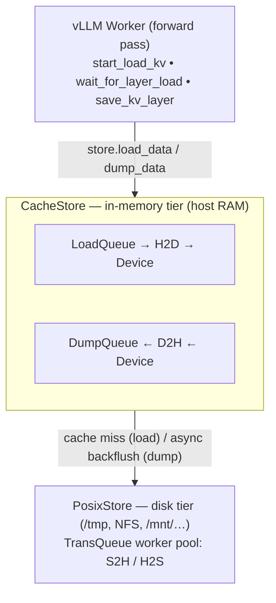
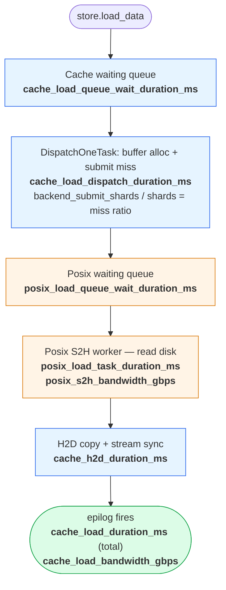
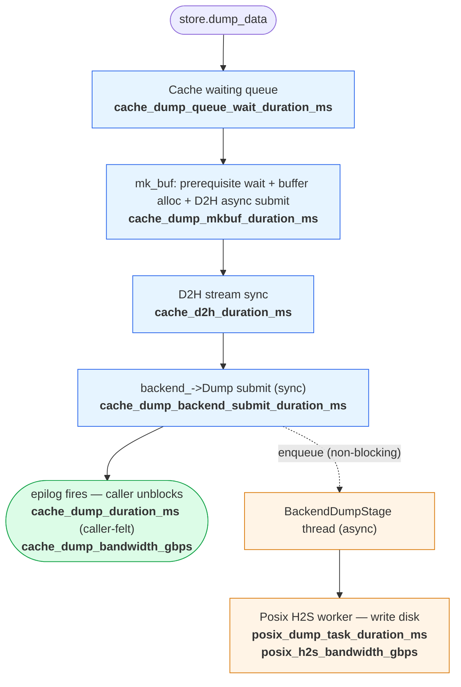

# Pipeline Store Performance Analysis (Cache | Posix)

This guide explains how to use the per-stage and layerwise metrics to
diagnose performance issues when running UCM with the
`pipelinestore("Cache|Posix")` backend, which is the most common
production configuration. It applies to both `UCMDirectConnector`
(non-layerwise) and `UCMLayerWiseConnector`.

It assumes you have already enabled the metrics configuration
(`metrics_config_path`) as described in `metrics.md`. Throughout this
document `ucm:` is the metric prefix; PromQL examples use the variable
`$model_name` (provided by the bundled Grafana dashboard).

---

## 1. Architecture and data flow

### 1.1 The storage tiers



### 1.2 LOAD data flow (Cache miss case)

When a load request descends from Python all the way to disk, every
stage along the path emits its own duration metric. Knowing which one
dominates is the first step in any diagnosis.



For a Cache **hit**, the chain is shorter — there is no backend wait,
H2D runs straight from the in-memory buffer:


### 1.3 DUMP data flow

Dump is asymmetric: from the user's perspective `wait` returns as soon
as the Cache mk_buf phase, D2H stream sync, and Posix submission
complete. The actual disk write happens later in `BackendDumpStage`
and does **not** block the caller.



The solid path is what the caller waits for; the dashed path is the
real disk write that runs in the background. They diverge sharply
when the Cache buffer absorbs bursts and converge when the buffer
saturates — see §3.4.

The implication: **`cache_dump_duration_ms` is what the user
felt; `posix_dump_task_duration_ms` is what the disk did.** They
can diverge by orders of magnitude when the Cache buffer is large
enough to absorb bursts. If they begin to track each other closely it
means the Cache buffer is full and back-pressure has propagated up to
the caller.

---

## 2. Critical metrics, ranked

When you sit down to diagnose a slow run, look at these in order. The
first one that's red usually points to the actual bottleneck.

| Rank | Metric | What it tells you |
|------|--------|-------------------|
| 1 | `ucm:cache_lookup_hit_rate` (gauge) | Is the cache helping at all? |
| 2 | `ucm:layerwise_wait_blocking_ms` (layerwise only) | Is the load/forward overlap working? |
| 3 | `ucm:cache_load_duration_ms` (avg or p99) | How slow are loads end-to-end? |
| 4 | `ucm:posix_load_task_duration_ms` | If load is slow: is it Posix's fault? |
| 5a | `rate(ucm:posix_s2h_bytes_total[5m]) / 1e9` (aggregated) | If Posix is slow: is the disk actually saturated? |
| 5b | `ucm:posix_s2h_bandwidth_gbps` (per task) | If 5a is low: is each IO fast but the worker has gaps, or is each IO itself slow? |
| 6 | `ucm:posix_load_queue_wait_duration_ms` | Or is it queueing on the worker pool? |
| 7 | `ucm:layerwise_save_tail_total_ms` | Is dump tail eating budget? |
| 8 | `ucm:cache_dump_duration_ms` vs `ucm:posix_dump_task_duration_ms` | Is the dump back-pressuring the caller? |

The rest are secondary signals used to confirm a hypothesis.

---

## 3. Diagnostic playbook

Each entry below is **symptoms → metric signature → likely cause →
tunables**. Numbers in brackets are illustrative thresholds — adjust
to your hardware.

### 3.1 Cache is barely helping (low hit rate)

**Symptoms.** Inference is no faster than running without UCM.
Recompute load is high.

**Metric signature.**
- `ucm:cache_lookup_hit_rate` < 0.3
- `rate(ucm:cache_load_backend_shards_total) /
   rate(ucm:cache_load_shards_total)` > 0.7
- `ucm:interval_lookup_hit_rates` (legacy, end-to-end) also low

**Likely causes.**
1. Cache buffer is too small — blocks evicted before reuse.
2. Workload diversity is too high — every prompt has unique prefixes.
3. Dumps aren't reaching Posix in time, so subsequent loads can't find
   the data — check error logs and the gap between
   `cache_dump_duration_ms` and `posix_dump_task_duration_ms`.

**Tunables.**
- `cache_buffer_capacity_gb` ↑ (Cache config) — biggest win usually.
- `posix_capacity_gb` ↑ (give the disk tier room for the working set).
- Verify hash seed + tokenizer match between writes and reads (if you
  recently bumped the model, old cache won't be addressable).

### 3.2 Cache hit rate is OK but loads are still slow

**Symptoms.** Hit rate looks healthy but `load_duration` is high
relative to your model's forward time.

**Metric signature.** `cache_load_duration_ms` is high.
Decompose by reading these in parallel:

| Component metric | Normal | High means |
|------------------|--------|------------|
| `cache_load_queue_wait_duration_ms` | < 1 ms | Load queue is saturated; too many concurrent requests |
| `cache_load_dispatch_duration_ms` | < 1 ms | Dispatch is rarely the bottleneck; if high, suspect lock contention |
| `posix_load_task_duration_ms` | depends on hit rate | Cache misses going to Posix — see §3.3 |
| `cache_h2d_duration_ms` | bounded by PCIe bw | Rare; suspect device-side contention or wrong stream affinity |

**Tunables.**
- Wait high → `waiting_queue_depth` ↑ or reduce concurrency.
- Posix slow → see §3.3.
- H2D high → check `cache_stream_number` and that pinned memory is
  actually pinned (compare H2D bandwidth to PCIe spec; pinned should
  hit > 20 GB/s on PCIe Gen4 x16).

### 3.3 Cache misses are slow because Posix is slow

**Symptoms.** `posix_load_task_duration_ms` dominates the load chain.

**Metric signature.**
- `posix_load_task_duration_ms` > `cache_h2d_duration_ms`
- `rate(ucm:posix_s2h_bytes_total[5m]) / 1e9` (aggregated actual GB/s)
  well below disk spec (e.g. < 1 GB/s on an NVMe rated for 3 GB/s)
- AND/OR `posix_load_queue_wait_duration_ms` high (queue buildup)

**Decision split:**

| If … | Then root cause | Fix |
|------|-----------------|-----|
| Aggregated BW low, per-task BW also low | Individual Posix tasks are slow — small IOs, no `O_DIRECT`, slow filesystem | Try `io_direct: true`, larger `tensor_size` / `shard_size` |
| Aggregated BW low, per-task BW high, wait low | Tasks are fast but workers are mostly idle — upstream is not feeding them | Re-check §3.2 components; usually Cache D2H / H2D is the actual bottleneck |
| Aggregated BW low, per-task BW high, wait high | Workers can't drain fast enough (queue saturated, parallel IOs not enough) | `posix_data_trans_concurrency` ↑ |
| Aggregated BW near disk spec, wait high | Burst arrival exceeds steady disk throughput | Add Cache capacity to absorb bursts; throttle inbound rate |
| Aggregated BW near disk spec, wait low | Posix is fine; the issue is upstream | Re-check §3.2 components |

> **What's the difference between (per task) and (aggregated)?**
>
> - **(per task)** = `posix_*_bandwidth_gbps` histogram. Each sample is
>   one Posix task's throughput (`total_bytes_in_task / task_wall_time /
>   1e9`). It is useful for task-level latency/throughput tails, but it
>   does not aggregate concurrent tasks.
> - **(aggregated)** = `rate(posix_*_bytes_total[interval]) / 1e9`.
>   Reflects **actual GB/s the service is pushing through posix**.
>   Multi-thread IO aggregates naturally; idle gaps between IOs are
>   included in the wall-clock denominator. Toggle the dashboard's
>   `View` selector to "Per Worker" to break it down by `worker_id`.
>
> Diagnostic mapping:
> - "Is the disk saturated / where is the bottleneck?" → **(aggregated)**
> - "Are there slow Posix tasks / a long tail?" → **(per task)** p99 / distribution

The same dichotomy applies to the **Cache** stage bandwidth panels,
with the per-event grain being a task instead of a single IO:

> **Cache Bandwidth (per task) vs Cache Bandwidth (aggregated)**
>
> - **(per task)** = `cache_*_bandwidth_gbps` histogram. Each sample
>   is one Cache stage task's throughput (`total_bytes_in_task /
>   task_wall_time / 1e9`). One task = one `start_load_kv` /
>   `wait_for_save` batch. Aggregates shards within a task; does NOT
>   aggregate across concurrent tasks.
> - **(aggregated)** = `rate(cache_*_bytes_total[interval]) / 1e9`.
>   Reflects **actual GB/s the service is pushing through the Cache
>   stage**. Concurrent tasks aggregate; idle gaps between tasks land
>   in the wall-clock denominator. Toggle the dashboard's `View`
>   selector to "Per Worker" to break it down by `worker_id`.
>
> The diagnostic mapping mirrors posix: "Cache layer's actual
> throughput / saturation" → **per worker**; "slow individual tasks
> / long tail" → **per task** p99 / distribution.

The same pattern repeats at the **Connector** layer (the topmost layer
that vLLM calls directly):

> **Connector Speed (per task) vs Connector Bandwidth (aggregated)**
>
> - **(per task)** = `load_speed` / `save_speed` histograms. Each
>   sample is `total_bytes_in_call / duration_of_call / 1e9`, recorded
>   once per `start_load_kv` / `wait_for_save` invocation. Reflects
>   **typical single-call speed**; switching `View` to Aggregated pools
>   observations across workers but the quantile is still per-call —
>   **does NOT sum**.
> - **(aggregated)** = `rate(load_bytes_total[interval]) / 1e9` (and
>   the save variant). Reflects **actual GB/s the whole vLLM service
>   is moving through UCM**. When `View=Aggregated` you see one summed
>   line; `View=Per Worker` breaks it down by `worker_id` and the
>   per-worker lines sum to the Aggregated value.
>
> If you want "summed throughput across workers" → **(aggregated)**;
> if you want "how fast is a typical single call" → **(per task)**.

### 3.4 Dumps are silently overflowing (back-pressure)

**Symptoms.** Loads start failing or hit rate drops over time even
though the workload looks the same. New requests wait longer than
expected.

**Metric signature.** Two conditions together:
- `ucm:cache_dump_duration_ms` (caller-felt) starts climbing
  toward `ucm:posix_dump_task_duration_ms` (disk-felt). When the
  Cache buffer is healthy these diverge sharply; when the buffer is
  saturated they converge.
- `ucm:posix_h2s_bandwidth_gbps` ≪ Cache dump rate

**Likely cause.** The Posix tier cannot keep up with sustained dump
throughput. Cache buffer fills, BackendDumpStage blocks, dispatch
blocks on buffer allocation, caller blocks.

**Tunables.**
- Easy: `posix_data_trans_concurrency` ↑ (more disk workers).
- Better: switch `posix_io_engine` to `aio` for high-depth workloads.
- Capacity: `cache_buffer_capacity_gb` ↑ to widen the absorption
  window if dump rate is bursty.

### 3.5 Layerwise mode shows no speedup over non-layerwise

**Symptoms.** You enabled `use_layerwise: true` expecting overlap, but
end-to-end latency or throughput barely changed.

**Metric signature.** This is exactly what
`layerwise_wait_blocking_ms` is for. Compare it against the time
between waits:

| `wait_blocking_ms` | `inter_wait_interval_ms` | Diagnosis |
|--------------------|--------------------------|-----------|
| ≈ 0 | any | **Overlap working perfectly.** If you still want gains, the bottleneck is elsewhere (the forward pass itself). |
| > 0, < `inter_wait_interval` | > 0 | Partial overlap — load is slightly slower than forward. Reduce load_duration (see §3.2-3.3) and gain will appear. |
| ≈ `cache_load_duration_ms` | small | **Pipeline degenerated to serial.** Forward is too fast to hide load. Likely you're decode-bound (one token per layer is fast, loads can't keep up) or Cache miss rate just spiked. |
| Large, growing | Stable | Backlog forming — submission is faster than completion. Check `next_layer_submit_ms` (should be < 1 ms; if not, store.load_data itself is slow). |

### 3.6 Layerwise mode: TTFT regression

**Symptoms.** First token is slower with layerwise than without.

**Metric signature.**
- `layerwise_first_layer_submit_ms` is high (rare; usually fast)
- OR `posix_load_task_duration_ms` is high during
  the first batch (cold cache, first-layer load goes all the way to
  disk before forward can start)

**Why TTFT is special in layerwise.** In non-layerwise, all layer
loads complete before forward begins, so TTFT = max(forward,
load_total). In layerwise, only the first layer must complete before
forward of layer 0 begins, but if the first layer's load is a Cache
miss, you pay full Posix latency upfront.

**Tunables.**
- Pre-warm: use prefix prefetching, or batch eviction policies that
  keep first-layer blocks resident.
- Verify the first-layer shard is actually the first item submitted —
  out-of-order shard submission can defeat the optimization.

### 3.7 Layerwise mode: dump tail at end of forward

**Symptoms.** Each forward iteration has an extra few-ms tail you
can't account for. Throughput just below expected.

**Metric signature.**
- `layerwise_save_tail_total_ms` consistently > 0 (e.g. 5-50 ms)

**Why.** Saves are submitted layer-by-layer during forward, but
`wait_for_save` at the end blocks for **all** of them. The tail is
the dumps that didn't finish before forward ended.

**Tunables.**
- Increase Cache dump throughput: `cache_stream_number` ↑.
- Increase Posix write throughput: `posix_data_trans_concurrency` ↑.
- If dump rate is the limit and can't be raised: accept the tail or
  reduce save load (e.g. only save final-layer KV for short prompts).

### 3.8 Non-layerwise mode: dump-bound iterations

**Symptoms.** Non-layerwise version of §3.4/§3.7. Each iteration
spends a noticeable chunk in `wait_for_save`.

**Metric signature.**
- Legacy `ucm:save_duration` is a meaningful fraction of one
  iteration's wall time
- `ucm:cache_dump_duration_ms` ≈ `ucm:save_duration` (no
  surprise — both measure roughly the same thing here)
- Posix h2s bandwidth healthy, h2s duration low → Cache dump front-end
  is the bottleneck, not disk; compare `cache_dump_mkbuf_duration_ms`
  vs `cache_d2h_duration_ms` to distinguish buffer/submit time from
  stream sync time
- Posix h2s slow → disk is the bottleneck

The split between Cache mk_buf, Cache D2H stream sync, and Posix H2S
tells you **whether to optimize the host/cache/disk pipeline at the
buffer setup, device-copy sync, or disk-write stage**. Those are very
different fixes.

### 3.9 Worker pool starvation (shared symptom)

**Symptoms.** Tail latencies are bad even when averages look fine.
Some requests are 10× slower than others.

**Metric signature.** Look at p99 vs avg of any duration metric — if
avg is fine but p99 is enormous, the workers are stuck on something:
- `posix_load_queue_wait_duration_ms` p99 → Posix workers blocked
   (slow disk IO, head-of-line blocking)
- `cache_load_queue_wait_duration_ms` p99 → Cache dispatcher
   blocked (rare — usually means deadlock or buffer exhaustion)

**Tunables.** Concurrency knobs (`*_concurrency` in config),
`cpu_affinity_cores` (avoid stepping on vLLM scheduler cores), and
`waiting_queue_depth` (drop loudly when full instead of growing
unbounded — the depth is also visible via the wait histogram).

---

## 4. Layerwise vs non-layerwise — what to look at

The pipeline-store metrics (`pipeline_*`) **apply identically to both
modes** — they live in the C++ layer and don't know which Python
connector called them. Use them the same way regardless of mode.

Where the analysis differs:

| Question | Non-layerwise | Layerwise |
|----------|---------------|-----------|
| "Is the load fast enough?" | Compare `load_duration` to forward time | Compare `wait_blocking_ms` to 0 |
| "What's the load latency?" | `load_duration` (= `start_load_kv` block) | `cache_load_duration_ms` (per-layer task; sum × n_layers if you want total) |
| "Are saves blocking forward?" | Yes by design — `save_duration` is on the critical path | Only the tail is — `save_tail_total_ms` |
| "Where's TTFT going?" | Total load is on the critical path before forward | `layerwise_first_layer_submit_ms` + first layer's `cache_load_*` chain |
| "Is the cache buffer big enough?" | Same indicator: hit rate, dump back-pressure (§3.4) |

A useful rule of thumb: in **layerwise** mode the most informative
single metric is `wait_blocking_ms` (overlap signal). In
**non-layerwise** mode it's `load_duration` plus the
`backend_wait_duration_ms` decomposition (locating the slow tier).

---

## 5. PromQL recipes

All examples assume the bundled Grafana dashboard's `$model_name`
template variable. Replace with a literal string for ad-hoc
querying.

**Cache hit rate (counter ratio, more accurate than the gauge for
historical analysis):**

```
rate(ucm:cache_lookup_hit_blocks_total{model_name="$model_name"}[5m])
/
clamp_min(
    rate(ucm:cache_lookup_hit_blocks_total{model_name="$model_name"}[5m])
  + rate(ucm:cache_lookup_miss_blocks_total{model_name="$model_name"}[5m]),
  1)
```

**Shard-level miss ratio at load time (descended to backend):**

```
rate(ucm:cache_load_backend_shards_total{model_name="$model_name"}[5m])
/
clamp_min(rate(ucm:cache_load_shards_total{model_name="$model_name"}[5m]), 1)
```

**P99 load duration per stage (decomposition of the load chain):**

```
histogram_quantile(0.99, sum by (le) (
  rate(ucm:cache_load_queue_wait_duration_ms_bucket{model_name="$model_name"}[5m])))

histogram_quantile(0.99, sum by (le) (
  rate(ucm:posix_load_task_duration_ms_bucket{model_name="$model_name"}[5m])))

histogram_quantile(0.99, sum by (le) (
  rate(ucm:cache_h2d_duration_ms_bucket{model_name="$model_name"}[5m])))
```

Sum these for an approximation of total load p99 (they're correlated,
so the sum overestimates — read trends, not absolute values).

**Average overlap loss (how much of forward time is wasted waiting on
loads):**

```
rate(ucm:layerwise_wait_blocking_ms_sum{model_name="$model_name"}[5m])
/
clamp_min(
  rate(ucm:layerwise_inter_wait_interval_ms_sum{model_name="$model_name"}[5m]),
  1)
```

Close to 0 = great overlap. Close to 1 = serial.

**Dump back-pressure ratio (caller-felt vs disk-felt):**

```
rate(ucm:cache_dump_duration_ms_sum{model_name="$model_name"}[5m])
/
rate(ucm:cache_dump_duration_ms_count{model_name="$model_name"}[5m])
```

vs.

```
rate(ucm:posix_dump_task_duration_ms_sum{model_name="$model_name"}[5m])
/
rate(ucm:posix_dump_task_duration_ms_count{model_name="$model_name"}[5m])
```

The first should be much smaller than the second. When they converge,
back-pressure has reached the caller (see §3.4).

**Posix worker pool utilization proxy:**

```
# average wait + IO per IO unit
(rate(ucm:posix_load_queue_wait_duration_ms_sum{model_name="$model_name"}[5m])
 + rate(ucm:posix_load_task_duration_ms_sum{model_name="$model_name"}[5m]))
/
rate(ucm:posix_load_task_duration_ms_count{model_name="$model_name"}[5m])
```

If wait dominates IO, increase `posix_data_trans_concurrency`.

---

## 6. Tunables, indexed by symptom

| Symptom (metric you saw) | First knob to try | Where it lives |
|--------------------------|-------------------|----------------|
| Low hit rate | `cache_buffer_capacity_gb` ↑ | Cache config |
| Cache dump back-pressure | `cache_buffer_capacity_gb` ↑, then `cache_stream_number` ↑ | Cache config |
| Posix wait high | `posix_data_trans_concurrency` ↑ | Posix config |
| Posix bandwidth low, latency low | `io_direct: true`, increase IO size via `tensor_size`/`shard_size` | Posix config |
| Posix bandwidth low, depth-limited | Switch `posix_io_engine: aio` | Posix config |
| Cache load wait high | `waiting_queue_depth` ↑ or reduce concurrency | Cache config |
| Layerwise no overlap | First confirm via `wait_blocking_ms`; then either reduce load latency (above knobs) or accept that workload is forward-bound | — |
| Layerwise save tail high | `cache_stream_number` ↑ (more dump streams), then `posix_data_trans_concurrency` ↑ | Cache + Posix |
| Bad p99, fine avg | `cpu_affinity_cores` (separate from vLLM cores) | Cache + Posix |

---

## 7. What this set of metrics does **not** tell you

For honesty, things the current instrumentation cannot resolve:

- **Per-block hot/cold distribution.** Hit/miss is aggregated; you
   can't see whether 5% of blocks account for 95% of hits.
- **Eviction events.** No counter for "blocks evicted from Cache" —
   sustained drops in hit rate are the indirect signal.
- **GPU compute time.** `inter_wait_interval_ms` includes save
   submission, not just forward. For tight forward-only timing, use
   vLLM's own metrics.
- **Network / RDMA tiers.** The Ds3fs and Mooncake backends are not
   instrumented by this set of metrics. If you switch off `Posix`,
   the Cache-side metrics still apply but the lower-tier ones become
   "no-op visible".
- **Per-request attribution.** All metrics are aggregated by
   `(model_name, worker_id)`. You cannot ask "which request was slow"
   from these metrics alone — combine with vLLM request logs or the
   `enable_record_traces` UCM option.
