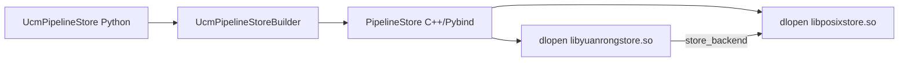
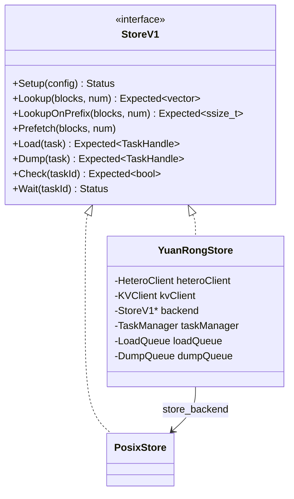
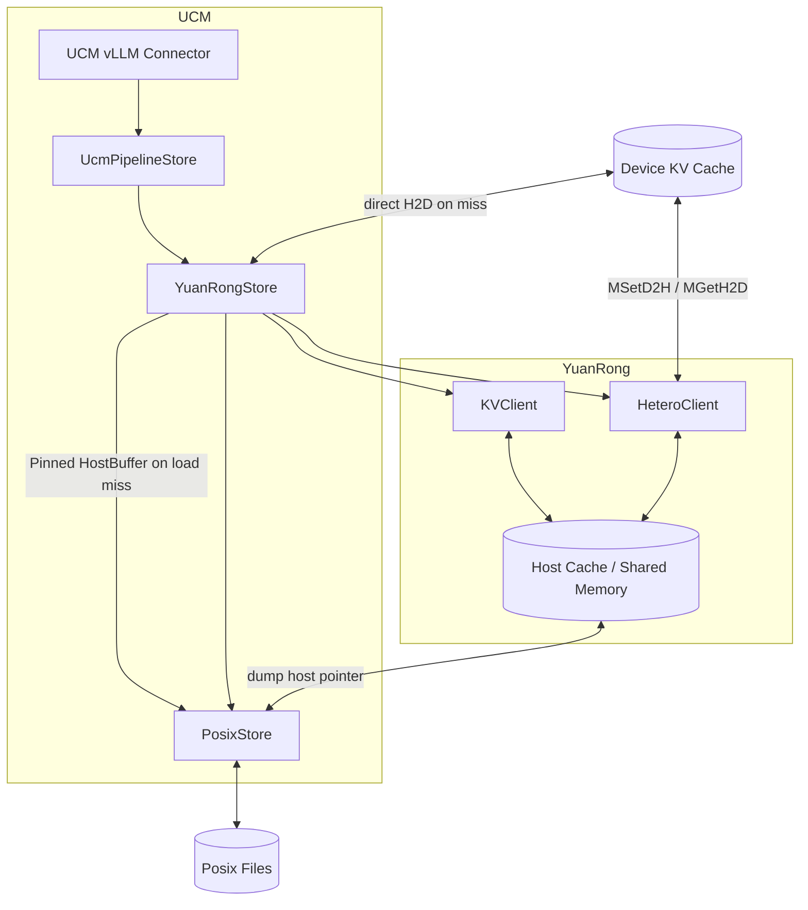
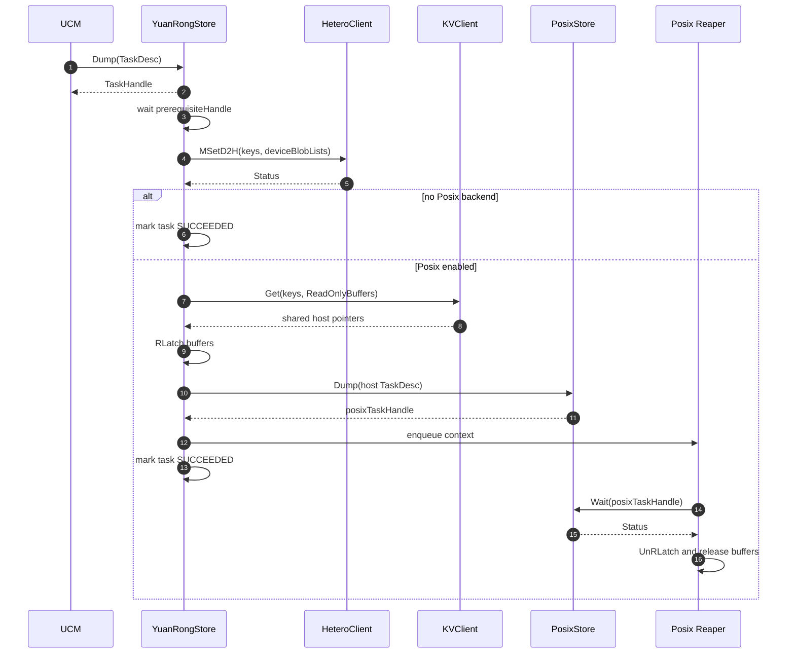
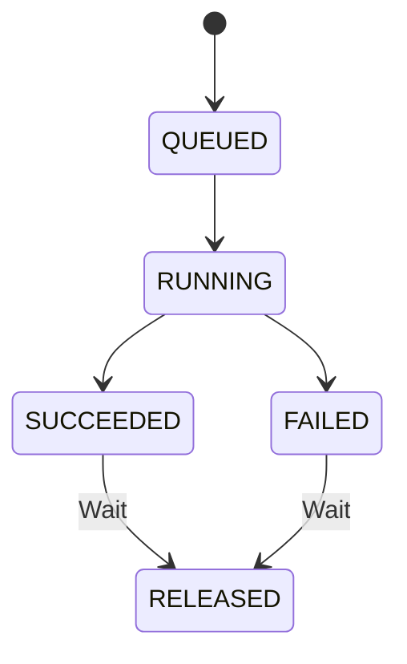
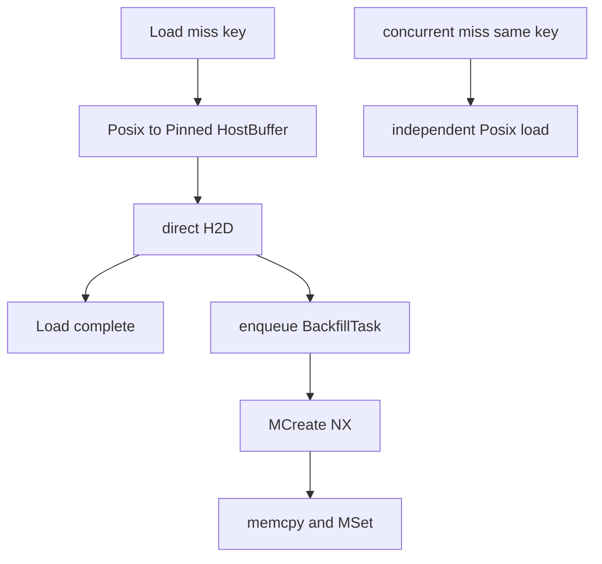
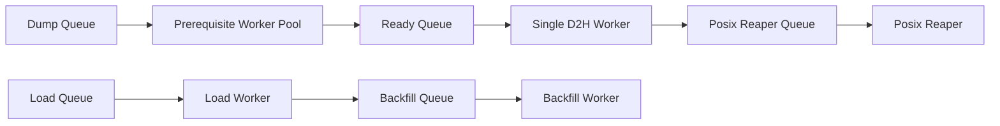

# UCM YuanRongStore 设计文档

## 1. 背景与目标

### 1.1 背景

本文描述如何在 Unified Cache Management（UCM）中新增 `YuanRongStore`，通过 YuanRong DataSystem 的 `HeteroClient::MSetD2H`、`HeteroClient::MGetH2D` 和 `KVClient` 共享内存接口，实现以下两级存储流水线：

```text
Device KV Cache <-> YuanRong Host Cache <-> Posix Persistent Storage
```

目标 Pipeline：

```yaml
store_pipeline: "YuanRong|Posix"
```

### 1.2 设计目标

本文重点定义：

- `YuanRongStore` 如何接入 `UcmPipelineStore`。
- Dump 如何只执行一次 D2H，并异步触发 Posix 落盘。
- Load 如何优先从 YuanRong 加载，miss 后由 Posix 加载到 Pinned HostBuffer 并直接 H2D，再异步回填 YuanRong。
- YuanRong Buffer、Posix 异步任务和 UCM Task 的生命周期。
- 并发、失败、配置和测试要求。

### 1.3 设计范围

- 新增 C++ `YuanRongStore : StoreV1`。
- 支持 `YuanRong` 和 `YuanRong|Posix` 两种 Pipeline。
- 使用 YuanRong C++ SDK。
- 使用 `MSetD2H/MGetH2D` 完成 Device 与 YuanRong Host Cache 之间的数据传输。
- 使用 `KVClient::Get` 获取 YuanRong Host Object 的只读地址并提交 Posix Dump。
- 使用 `KVClient::MCreate/MSet` 将 Posix HostBuffer 中的数据异步回填 YuanRong。
- 支持 UCM 的异步 `Load/Dump/Check/Wait` 语义。

## 2. 整体架构

### 2.1 现有 UcmPipelineStore 模型

`UcmPipelineStore` 根据 `store_pipeline` 查找 builder，并通过 `PipelineStore::Stack` 动态加载 Store：



`PipelineStore::Stack` 按配置顺序压栈。对于：

```text
YuanRong|Posix
```

实际构造顺序为：

1. `PosixStore`
2. `YuanRongStore`

最终调用入口是栈顶的 `YuanRongStore`，其 `store_backend` 指向 `PosixStore`。



### 2.2 目标架构



#### 核心原则

1. YuanRong hit 使用 `MGetH2D`；Posix miss 使用 UCM CopyStream 从 Pinned HostBuffer 直接 H2D。
2. Dump 的 PosixStore 读取 YuanRong Host 指针；Load 的 PosixStore 写入 UCM Pinned HostBuffer。
3. Dump 完成只保证 YuanRong D2H 成功且 Posix 异步任务提交成功，不等待磁盘写入完成。
4. Load 完成必须保证最终 H2D 完成。
5. 所有交给 Posix 的 YuanRong Buffer 必须持有到 Posix 任务结束。
6. YuanRong 中每个 key 对应一个连续 Host Object，其布局等于一个 UCM shard 内所有 device blob 按顺序拼接后的布局。

## 3. 核心数据流

### 3.1 Dump 流程

#### 完成语义

Dump Task 成功表示：

1. `prerequisiteHandle` 已满足。
2. `MSetD2H` 已将 Device 数据写入 YuanRong Host Object。
3. 如果配置了 Posix 后端，已通过 `KVClient::Get` 获取 Host Object。
4. Posix Dump 任务已成功提交。

Dump Task 不等待 Posix 真正写盘结束。

#### Dump 时序

```
Device
  -> MSetD2H
YuanRong Host Object
  -> KVClient::Get host pointer
  -> submit Posix Dump
  -> UCM Dump Task complete
  -> background Posix Wait
  -> release ReadOnlyBuffer
```



#### Dump 处理步骤

1. 构造 keys 和 `DeviceBlobList`。
2. 等待 `TaskDesc::prerequisiteHandle`，确保 NPU 计算完成。
3. 调用 `MSetD2H`，通过 `outLocalSetKeys` 获取本次调用在连接 Worker 上确认发布成功的 key：

```cpp
heteroClient_->MSetD2H(keys, deviceBlobLists, setParam, &outLocalSetKeys);
```

4. 不做 pre-Exist 或 post-Exist；Posix 只处理 `outLocalSetKeys`，不确定归属的 key 不落盘。
5. 如果没有 Posix 后端，Dump Task 结束。
6. 如果存在 Posix 后端，批量调用：

```cpp
std::vector<datasystem::Optional<datasystem::ReadOnlyBuffer>> buffers;
kvClient_->Get(keys, buffers, timeoutMs);
```

7. 对每个有效 Buffer：

```cpp
buffer.RLatch(timeoutSec);
buffer.ImmutableData();
buffer.GetSize();
```

8. 校验 `GetSize() == host_object_size`。
9. 使用 Host 指针构造 Posix Dump Task。
10. Posix `Dump()` 成功返回 handle 后，将以下对象移入后台上下文：

```cpp
struct PosixDumpContext {
    Detail::TaskHandle posixTaskId;
    std::vector<Optional<ReadOnlyBuffer>> buffers;
};
```

11. 标记前台 Dump Task 成功。
12. 后台线程调用 `PosixStore::Wait()`，随后 `UnRLatch` 并销毁 Buffer。

#### Posix 后台失败

因为前台 Dump Task 在 Posix 提交后已经完成，后续写盘失败不能再修改前台任务结果。后台失败必须：

- 输出包含 key、block、shard 和 Posix task id 的错误日志。
- 增加失败指标。
- 释放所有 latch 和 Buffer。
- 不删除 YuanRong Host Object。

此语义表示 YuanRong 是当前可读副本，Posix 是异步持久化副本。

### 3.2 Load 流程

#### 完成语义

Load Task 成功表示所有请求的 shard 已写入目标 Device 地址。

Load 优先访问 YuanRong。仅对 miss key 从 Posix 回源：

```text
前台：Posix -> Pinned HostBuffer -> UCM direct H2D -> Device
后台：Pinned HostBuffer -> MCreate -> memcpy -> MSet -> YuanRong
```

#### Load 时序

```
MGetH2D
  -> hit: Device ready
  -> miss:
       Posix Load into Pinned HostBuffer
       -> UCM direct H2D
       -> Device ready
       -> enqueue asynchronous YuanRong backfill
       -> UCM Load Task complete
```

```mermaid
sequenceDiagram
    autonumber
    participant UCM
    participant YR as YuanRongStore
    participant HC as HeteroClient
    participant CS as CopyStream
    participant BQ as BackfillQueue
    participant PX as PosixStore

    UCM->>YR: Load(TaskDesc)
    YR-->>UCM: TaskHandle

    YR->>HC: MGetH2D(all keys, all device blobs)
    HC-->>YR: failedKeys

    alt all hit
        YR->>YR: mark task SUCCEEDED
    else miss and no Posix backend
        YR->>YR: mark task FAILED
    else miss and Posix enabled
        loop batches of yuanrong_recovery_batch_size
            par prepare next HostBatch
                YR->>PX: Load(Posix -> Pinned HostBuffer)
                PX-->>YR: next posixTaskHandle
            and finalize current batch
                YR->>PX: Wait(current posixTaskHandle)
                PX-->>YR: Status
                YR->>CS: HostToDeviceAsync + Synchronize
                CS-->>YR: Status
                YR->>BQ: enqueue HostBuffer ownership
            end
        end
        YR->>YR: mark SUCCEEDED or FAILED
    end

    BQ->>BQ: MCreate NX + memcpy + MSet
    Note over BQ: failure only logs; it does not change completed Load result
```

#### Load 处理步骤

1、第一步：尝试 YuanRong

```cpp
std::vector<std::string> failedKeys;
auto rc = heteroClient_->MGetH2D(
    keys, deviceBlobLists, failedKeys, timeoutMs);
```

必须以 `failedKeys` 判断逐 key 结果：

- `failedKeys` 为空：全部完成。
- `failedKeys` 非空：仅这些 key 进入回源。
- 总 `Status` 错误且 `failedKeys` 为空：保守地将全部 key 视为失败。

2、Posix 加载到 Pinned HostBuffer

将 miss keys 按 `yuanrong_recovery_batch_size` 切批。每个 miss shard 从预分配
`HostBufferPool` 获取一个连续 Pinned Buffer，并构造：

```cpp
Detail::Shard hostShard{
    .owner = original.owner,
    .index = original.index,
    .addrs = {hostBuffer.get()},
};
```

提交 Posix Load，并等待完成：

```cpp
auto taskId = backend_->Load(hostTask);
auto status = backend_->Wait(taskId);
```

每批必须等待 Posix 完成后才能使用该 HostBuffer。当前批次等待 Posix并执行H2D时，
后台线程同时为下一批获取HostBuffer并提交Posix Load。

3、直接H2D

Load worker持有设备线程内创建的CopyStream。它按`DeviceBlobList`的blob顺序，
从连续HostBuffer的对应offset执行`HostToDeviceAsync`，并在移交Buffer前同步所有stream。
Posix失败或直接H2D失败会使Load Task失败。

4、异步回填YuanRong

直接H2D成功后，将keys和HostBuffer所有权移交BackfillQueue。后台依次执行：

```text
MCreate NX -> initialize composed header -> memcpy payload -> MSet
```

回填成功前，后续请求仍可能从Posix加载。回填失败或队列满只记录日志，
不回滚已经完成的前台Load。`MCreate NX`发现key已存在时跳过该key，不覆盖已有对象。

## 4. 详细实现设计

### 4.1 数据模型

#### Key 编码

建议 key 格式：

```text
ucm_{namespace}_{block_id_hex}_{shard_index}
```

字段含义：

| 字段 | 含义 |
|---|---|
| `ucm` | 固定前缀 |
| `namespace` | 模型、部署或 UCM 实例的唯一命名空间 |
| `block_id_hex` | 16 字节 `BlockId` 的十六进制字符串 |
| `shard_index` | `Detail::Shard::index` |

要求：

- key 长度不超过 YuanRong 限制。
- key 仅使用 YuanRong 允许的字符。分隔符使用下划线，不使用冒号。
- scheduler 和 worker 必须使用相同的 `namespace`。
- key 对应的数据视为不可变；相同 key 必须表示相同内容。

#### DeviceBlobList 映射

一个 UCM shard：

```cpp
Detail::Shard {
    owner,
    index,
    addrs = {device_ptr_0, device_ptr_1, ...}
}
```

转换为：

```cpp
datasystem::DeviceBlobList blobList;
blobList.deviceIdx = deviceId;
blobList.srcOffset = 0;
blobList.blobs = {
    {device_ptr_0, tensor_size_list[0]},
    {device_ptr_1, tensor_size_list[1]},
    ...
};
```

约束：

- `addrs.size() == tensor_size_list.size()`。
- 同一个 `DeviceBlobList` 内所有地址必须位于同一设备。
- YuanRong Host Object 大小为：

```text
host_object_size = sum(tensor_size_list)
```

- Host Object 中的数据顺序与 `DeviceBlobList.blobs` 顺序一致。

#### Posix 子层布局

YuanRong Host Object 是一个连续 buffer，而设备侧 shard 可能包含多个地址。因此传给 Posix 子层的任务必须归一化为：

```cpp
Detail::Shard {
    owner,
    index,
    addrs = {yuanrong_host_pointer}
}
```

Posix 子层配置：

```text
tensor_size = host_object_size
shard_size  = host_object_size
block_size  = host_object_size * shards_per_block
```

这样 Posix 的 psync 路径可以把一个 shard 作为连续 Host Buffer 读写。当前 aio
路径固定使用 `O_DIRECT`，首期不支持。

> 注意：这里传入 PosixStore 的地址是 Host 地址。配置中的 `device_id >= 0` 仅用于启用 PosixStore 的传输任务，不代表该地址必须是 Device 地址。建议后续把 PosixStore 的 `transEnable` 配置从 `device_id` 中解耦，增加明确的 `transfer_enable` 或 `memory_type`，但首期可保持现有接口。

### 4.2 YuanRongStore 组件设计

建议目录：

```text
ucm/store/yuanrongstore/
├── CMakeLists.txt
└── cc/
    ├── yuanrong_store.cc
    ├── yuanrong_config.h
    ├── task_manager.h
    ├── task_manager.cc
    ├── trans_task.h
    ├── yuanrong_helper.h
    ├── copy_stream.h
    ├── host_buffer_pool.h
    ├── backfill_queue.h
    ├── backfill_queue.cc
    ├── load_queue.h
    ├── load_queue.cc
    ├── dump_queue.h
    └── dump_queue.cc
```

#### YuanRongStore

职责：

- 解析配置并初始化客户端。
- 将 UCM block/shard 转换为 YuanRong key 和 DeviceBlobList。
- 实现 `Lookup/LookupOnPrefix`。
- 创建异步 Load/Dump Task。
- 将 PosixStore 作为可选回源后端。

建议成员：

```cpp
class YuanRongStore : public StoreV1 {
private:
    YuanRongConfig config_;
    std::shared_ptr<datasystem::HeteroClient> heteroClient_;
    std::shared_ptr<datasystem::KVClient> kvClient_;
    StoreV1* backend_{nullptr};
    TaskManager taskManager_;
    LoadQueue loadQueue_;
    DumpQueue dumpQueue_;
};
```

`HeteroClient` 和 `KVClient` 必须使用一致的连接配置、认证信息和 tenant，确保两类客户端访问同一命名空间中的对象。

#### TaskManager

`StoreV1::Load/Dump` 必须快速返回 `TaskHandle`，不能在调用线程中同步执行完整传输。



任务对象建议包含：

```cpp
enum class TaskState {
    QUEUED,
    RUNNING,
    SUCCEEDED,
    FAILED,
};

struct YuanRongTask {
    Detail::TaskHandle id;
    TaskType type;
    TaskState state;
    Status result;
    std::mutex mutex;
    std::condition_variable cv;
};
```

接口语义：

- `Check(id)`：仅查询任务是否进入终态，不删除任务。
- `Wait(id)`：等待终态，返回任务结果，并从任务表删除任务。
- 后台 Posix Dump 不属于前台 Dump Task，但必须由独立后台上下文跟踪并释放资源。

### 4.3 并发回源与异步回填

#### 问题

多个请求可能同时 miss 同一个 YuanRong key。

#### 多 worker 回源

`LoadQueue` 使用一个 dispatcher 和多个 worker 处理 Load Task。dispatcher 从
入口 `waiting_` 队列取任务，并按轮询方式分发到 worker 私有的 SPSC 队列；
worker并发执行YuanRong `MGetH2D`、Posix回源和直接H2D。

异步回填完成前，同一个key的并发请求允许分别从Posix回源，保证前台请求不等待后台缓存发布。
多个BackfillTask发布同一key时由`MCreate NX`解决竞争；已有key使用占位Buffer表示，
后台任务不覆盖它。回填仅是缓存优化，不参与前台Load成功判定。



配置项：

```yaml
yuanrong_load_worker_count: 4
yuanrong_dump_prerequisite_worker_count: 2
yuanrong_recovery_batch_size: 32
yuanrong_host_buffer_count: 0
yuanrong_host_buffer_capacity_gb: 8
yuanrong_h2d_stream_count: 4
yuanrong_backfill_worker_count: 1
yuanrong_backfill_queue_depth: 128
```

`yuanrong_recovery_batch_size`控制Posix和直接H2D批次。`yuanrong_host_buffer_count=0`
时，按照Load worker双批流水线、Backfill worker并发数和pinned host内存容量自动推导完整批次数；
非零值作为显式覆盖且不受自动容量上限约束。纯YuanRong模式不分配该HostBuffer池。Backfill
worker默认单线程，避免后台MCreate和内存复制过度争用前台资源。

### 4.4 Lookup 和 Prefetch

#### Lookup

`Lookup` 优先调用：

```cpp
heteroClient_->Exist(keys, exists);
```

对于 YuanRong miss：

- 若没有 Posix 后端，返回 miss。
- 若存在 Posix 后端，可继续查询 `backend_->Lookup`，使 scheduler 能发现 Posix 中的数据。

逻辑结果：

```text
exists = yuanrong_exists OR posix_exists
```

#### LookupOnPrefix

按顺序查找最长连续前缀：

1. 批量查询 YuanRong。
2. 对第一个 YuanRong miss 及之后的 block 查询 Posix。
3. 只有连续命中才扩展前缀。

需要注意 UCM `Lookup` 输入只有 block id，没有 shard index。应沿用 UCM 当前约定，使用代表 block 可用性的固定 shard（通常是 shard 0）作为 YuanRong Lookup key，或者在 Dump 完成时额外写入 block manifest。首期建议使用 shard 0，并要求各 shard 一致写入。

#### Prefetch

当前为空操作。后续可以：

- 查询 Posix 命中。
- 后台执行 Posix -> YuanRong Host Cache。
- 不执行 H2D。

### 4.5 错误处理

| 阶段 | 行为 |
|---|---|
| prerequisite event 失败 | Dump Task 失败 |
| `MSetD2H` 失败 | Dump Task 失败，不提交 Posix |
| Dump 后 `KVClient::Get` 失败 | Dump Task 失败 |
| Posix Dump 提交失败 | Dump Task 失败并立即释放 Buffer |
| Posix Dump 后台执行失败 | 记录日志和指标，前台 Dump 结果不回滚 |
| 首次 `MGetH2D` 部分 miss | 对 failed keys 回源 |
| Load miss 且无 Posix 后端 | Load Task 失败 |
| HostBuffer获取超时 | Load Task失败 |
| Posix Load失败 | Load Task失败并释放HostBuffer |
| 直接H2D失败 | 同步已提交stream后Load Task失败 |
| Backfill队列满 | 放弃回填并记录日志，Load结果不变 |
| 后台`MCreate/MSet`失败 | 记录日志并释放HostBuffer，Load结果不变 |
| `Wait` 未知 task id | 返回 InvalidParam |

所有错误路径必须释放：

- YuanRong Buffer。
- read/write latch。
- Posix task handle。
- UCM task table entry（由 `Wait` 完成最终删除）。

## 5. 配置与集成

### 5.1 配置设计

示例：

```yaml
ucm_connectors:
  - ucm_connector_name: "UcmPipelineStore"
    ucm_connector_config:
      store_pipeline: "YuanRong|Posix"

      yuanrong_host: "127.0.0.1"
      yuanrong_port: 9088
      yuanrong_namespace: "model-a-dp0"
      yuanrong_enable_remote_h2d: true
      yuanrong_memory_alignment: 4096
      yuanrong_timeout_ms: 60000
      storage_backends:
        - "/mnt/ucm"
      posix_io_engine: "psync"
      io_direct: true

enable_event_sync: true
use_layerwise: false
```

配置说明：

| 配置 | 必选 | 默认值 | 说明 |
|---|---:|---:|---|
| `yuanrong_host` | 是 | - | YuanRong worker 地址 |
| `yuanrong_port` | 是 | - | YuanRong worker 端口 |
| `yuanrong_namespace` | 是 | - | key 隔离命名空间 |
| `yuanrong_enable_remote_h2d` | 否 | `true` | YuanRong Remote H2D |
| `yuanrong_memory_alignment` | 否 | `64` | UCM解析和构造composed object使用；Direct IO必须为`4096` |
| `yuanrong_timeout_ms` | 否 | `60000` | SDK 调用超时 |
| `yuanrong_dump_prerequisite_worker_count` | 否 | `2` | 并发等待Dump prerequisite event的worker数 |
| `tensor_size_list` | worker 必选 | 自动生成 | 每个 device blob 的字节数 |
| `device_id` | worker 必选 | - | NPU device id |
| `storage_backends` | Posix 必选 | - | Posix 路径 |
| `posix_io_engine` | Posix 必选 | `psync` | 首期仅支持 `psync` |

`enable_event_sync` 必须开启，以确保 Dump 的 `prerequisiteHandle` 有效。

`YuanRong|Posix`仅支持`posix_io_engine: "psync"`。启用`io_direct: true`时必须满足：

- YuanRong Worker配置`memory_alignment=4096`，并保留默认的
  `oc_metadata_header=true`。metadata header会按4096对齐，且read latch可保护后台
  Posix读取期间的共享内存。
- Worker在client注册响应中返回`memory_alignment`，SDK client自动使用该值组装
  composed header，不修改进程级flag，也不对外暴露alignment查询接口。
- UCM独立配置`yuanrong_memory_alignment: 4096`，仅用于Posix dump解析、异步回填
  构造composed object和Direct IO校验，不传入YuanRong `ConnectOptions`。
- `host_object_size`是4096的整数倍；UCM在提交Posix任务前再次校验实际payload
  地址和长度。
- Posix miss恢复使用Direct IO对齐的HostBuffer。UCM持有read latch和
  `ReadOnlyBuffer`直到后台Posix Dump完成。

### 5.2 Pipeline 注册

在 `ucm/store/pipeline/connector.py` 增加：

```python
def _yuanrong_pipeline_builder(config, pipeline):
    store_dir = Path(__file__).resolve().parent.parent
    pipeline.Stack(
        "YuanRong",
        str(store_dir / "yuanrongstore/libyuanrongstore.so"),
        config,
    )


def _yuanrong_posix_pipeline_builder(config, pipeline):
    store_dir = Path(__file__).resolve().parent.parent

    object_size = sum(config["tensor_size_list"])
    posix_config = copy.deepcopy(config)
    posix_config["tensor_size"] = object_size
    posix_config["shard_size"] = object_size
    posix_config["block_size"] = object_size * config["shards_per_block"]

    pipeline.Stack(
        "Posix",
        str(store_dir / "posix/libposixstore.so"),
        posix_config,
    )
    pipeline.Stack(
        "YuanRong",
        str(store_dir / "yuanrongstore/libyuanrongstore.so"),
        config,
    )
```

注册：

```python
UcmPipelineStoreBuilder.register("YuanRong", _yuanrong_pipeline_builder)
UcmPipelineStoreBuilder.register(
    "YuanRong|Posix", _yuanrong_posix_pipeline_builder
)
```

`shards_per_block` 如果当前 connector 没有直接提供，应由：

```text
block_size / shard_size
```

推导，并在 builder 中校验整除关系。

### 5.3 构建集成

#### CMake

修改：

```text
ucm/store/CMakeLists.txt
```

增加：

```cmake
add_subdirectory(yuanrongstore)
```

`yuanrongstore/CMakeLists.txt` 需要：

- 查找 YuanRong SDK headers。
- 查找 `libdatasystem.so`。
- 链接 `storeintf`、`infra_logger`、`fmt` 和 YuanRong SDK。
- 若使用 Ascend event API，链接 Ascend runtime。
- 设置 SDK library 的 build/install rpath。
- 依赖不存在时跳过构建并输出明确提示。

动态库必须导出：

```cpp
extern "C" UC::StoreV1* MakeYuanRongStore();
```

## 6. 线程与资源模型

建议线程：



### 6.1 Dump Worker

- prerequisite worker pool并发等待事件，数量由`yuanrong_dump_prerequisite_worker_count`控制。
- 单个D2H worker串行执行`MSetD2H`，避免相同前缀并发发布冲突。
- 获取 `ReadOnlyBuffer`。
- 提交 Posix。
- 将资源移交 Reaper。
- 完成前台任务。

### 6.2 Posix Reaper

- 等待 Posix Dump。
- 记录后台结果。
- 解锁并释放 `ReadOnlyBuffer`。

### 6.3 Load Worker

- 执行首次 `MGetH2D`。
- 将miss keys切分为恢复批次。
- 从HostBufferPool获取Pinned Buffer并提交Posix Load。
- 等待当前批次Posix完成并直接H2D。
- H2D同步后将HostBuffer移交BackfillQueue。
- 等待所有批次完成后再结束 Load Task。

### 6.4 Backfill Worker

- 调用`MCreate NX`创建YuanRong组合对象。
- 初始化组合对象header并从Pinned HostBuffer复制payload。
- 调用`MSet`发布新建对象。
- 无论成功失败都释放HostBuffer；失败不修改前台Load Task状态。

## 7. 关键伪代码

### 7.1 Dump

```cpp
Status DumpQueue::Run(TaskPtr task)
{
    RETURN_IF_NOT_OK(WaitPrerequisite(task->prerequisiteHandle));

    auto keys = BuildKeys(task->shards);
    auto deviceBlobs = BuildDeviceBlobLists(task->shards);
    RETURN_IF_NOT_OK(ToUcmStatus(
        heteroClient_->MSetD2H(keys, deviceBlobs, setParam_)));

    if (backend_ == nullptr) {
        return Status::OK();
    }

    std::vector<Optional<ReadOnlyBuffer>> buffers;
    RETURN_IF_NOT_OK(ToUcmStatus(
        kvClient_->Get(keys, buffers, config_.timeoutMs)));

    auto hostTask = BuildHostDumpTask(task->shards, buffers);
    auto posixTask = backend_->Dump(std::move(hostTask));
    if (!posixTask) {
        UnlockAndRelease(buffers);
        return posixTask.Error();
    }

    posixReaper_.Submit({
        .taskId = posixTask.Value(),
        .buffers = std::move(buffers),
    });
    return Status::OK();
}
```

### 7.2 Load

```cpp
Status LoadQueue::Run(TaskPtr task)
{
    auto keys = BuildKeys(task->shards);
    auto deviceBlobs = BuildDeviceBlobLists(task->shards);

    auto failed = MGet(keys, deviceBlobs);
    if (failed.empty()) {
        return Status::OK();
    }
    if (backend_ == nullptr) {
        return Status::Error("YuanRong miss and no backend");
    }

    auto batches = SplitRecoveryBatches(failed, recoveryBatchSize_);
    auto current = PrepareHostBatch(batches.front(), task);
    Status result = Status::OK();
    for (size_t i = 0; i < batches.size(); ++i) {
        auto next = i + 1 < batches.size()
            ? PrepareHostBatchAsync(batches[i + 1], task)
            : InvalidFuture();
        KeepFirstFailure(result, FinalizeHostBatch(current));
        if (next.Valid()) {
            current = next.Get();
        }
    }
    return result;
}
```

## 8. 测试设计

### 8.1 单元测试

必须覆盖：

1. BlockId 和 shard index 的 key 编码。
2. `TaskDesc` 到 `DeviceBlobList` 的地址和 size 映射。
3. Dump 等待 prerequisite。
4. Dump 在 Posix 提交后完成，而非 Posix Wait 后完成。
5. Posix Reaper 持有 Buffer 到 Wait 结束。
6. Load 全命中，不访问 Posix。
7. Load 部分 miss，只回源 failed keys。
8. Posix Load完成前不提交直接H2D。
9. 直接H2D同步完成后才移交HostBuffer。
10. 后台`MCreate/MSet`失败不改变前台Load结果。
11. `MGetH2D`总Status与`failedKeys`的组合处理。
12. `Check` 不删除任务，`Wait` 删除任务。
13. 所有失败路径释放 Buffer 和 latch。
14. 多worker并发相同key时允许各自Posix回源，`MCreate NX`保证回填不覆盖。
15. 119 个 miss、批次大小 32 时生成 `32 + 32 + 32 + 23` 四个批次。
16. 当前批次完成顺序必须是`Posix Wait -> direct H2D -> stream sync -> enqueue backfill`。

### 8.2 集成测试

建议新增：

```text
ucm/store/test/e2e/yuanrong_store_test.py
ucm/store/test/e2e/yuanrong_on_posix_test.py
```

场景：

| 场景 | 预期 |
|---|---|
| Dump -> YuanRong -> Load | 数据一致 |
| Dump -> 异步 Posix -> 清空 YuanRong -> Load | 从Posix直接H2D，随后异步恢复YuanRong |
| YuanRong 部分 key miss | 仅 miss key 访问 Posix |
| Posix 不存在 | Load 返回失败 |
| 并发加载同一key | 请求均可完成，后台回填由`MCreate NX`解决竞争 |
| 后台回填失败 | 当前Load成功，后续请求再次从Posix回源 |
| Posix Dump 后台失败 | 前台 Dump 已成功，指标记录失败 |
| 多 blob shard | Host Object 拼接和拆分顺序正确 |
| `io_direct=false` | 64字节默认对齐链路通过 |
| `io_direct=true`且配置匹配 | 4096对齐Dump和Load链路通过 |
| `io_direct=true`且alignment/header/object size不匹配 | 初始化直接拒绝 |

### 8.3 数据一致性校验

测试数据应对每个 tensor 使用不同 pattern，验证：

```text
device blob 0 || device blob 1 || ... || device blob N
```

在 YuanRong Host Object、Posix 文件和最终 Device 中顺序及内容完全一致。
