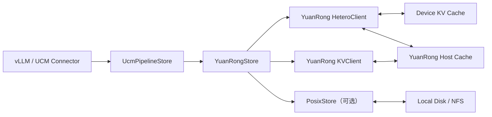
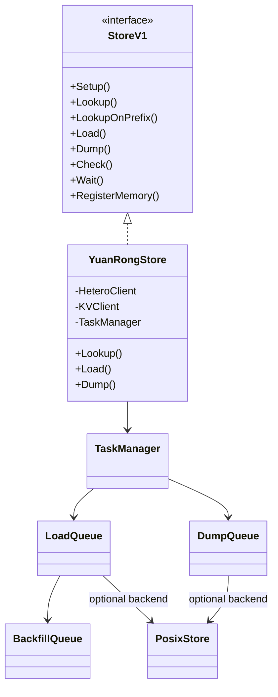
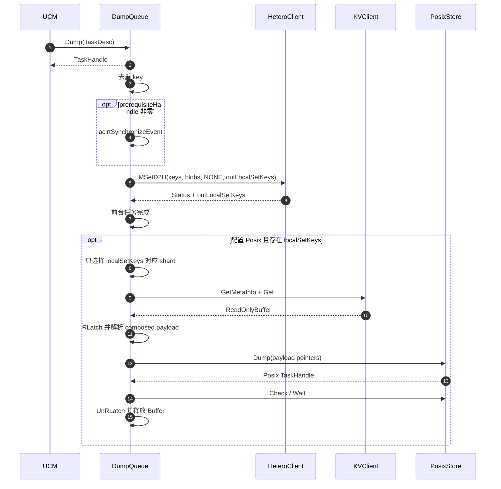
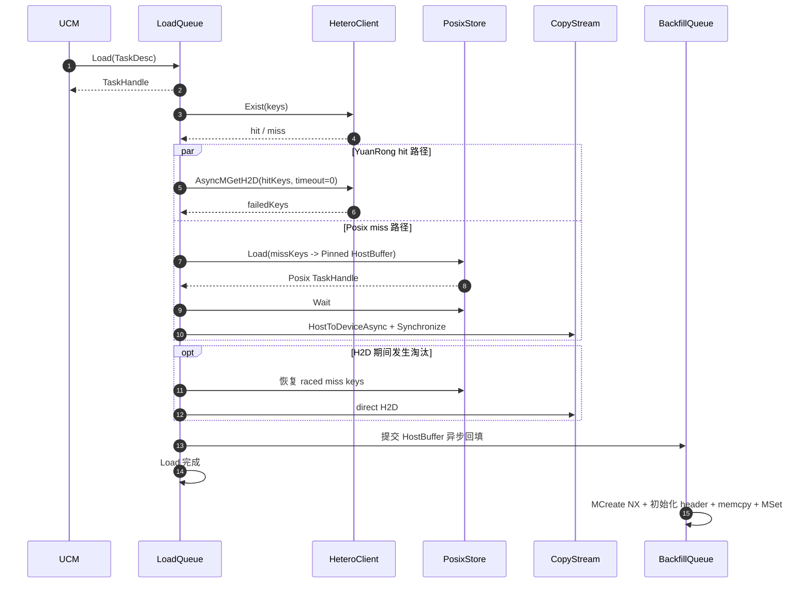
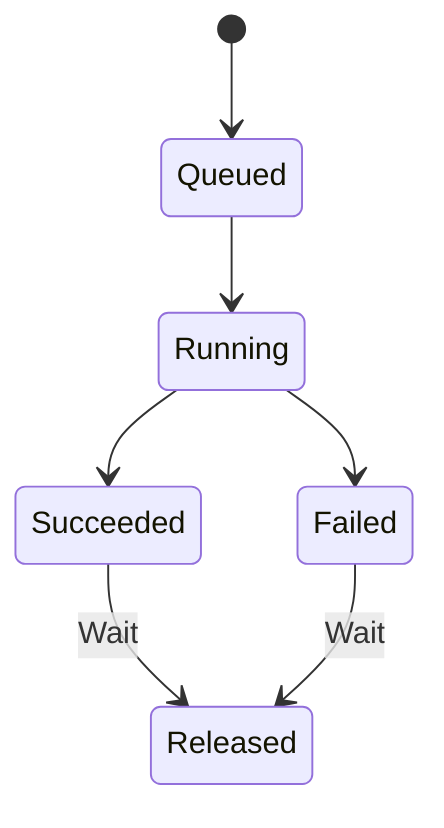

# UCM YuanRongStore 适配设计

## 1. 背景与目标

### 1.1 背景

UCM 通过 `UcmPipelineStore` 组合不同层级的 KV Cache。YuanRongStore 使用
YuanRong DataSystem 的异构传输与共享内存能力，提供以下两种部署方式：

```yaml
store_pipeline: "YuanRong"
```

```yaml
store_pipeline: "YuanRong|Posix"
```

对应的数据路径为：

```text
YuanRong:       Device <-> YuanRong Host Cache
YuanRong|Posix: Device <-> YuanRong Host Cache <-> Posix
```

### 1.2 目标

- 使用 `HeteroClient::MSetD2H/MGetH2D` 完成 Device 与 YuanRong 间传输。
- Dump 只执行一次 D2H，前台完成后异步持久化到 Posix。
- Load 优先命中 YuanRong；miss 时从 Posix 恢复并直接 H2D，再异步回填 YuanRong。
- 支持部分命中、多 worker 并发、Remote H2D、Direct IO 和 UCM 异步任务语义。
- 明确前台任务与后台持久化、回填任务的成功边界和资源生命周期。

## 2. 整体架构

### 2.1 Pipeline 组合

`PipelineStore` 按配置构造 Store。`YuanRong|Posix` 中，YuanRongStore 是入口，
PosixStore 通过 `store_backend` 注入为后端。



### 2.2 组件职责



核心组件：

| 组件 | 职责 |
|---|---|
| `YuanRongStore` | 配置、客户端初始化、Lookup、内存注册、任务提交 |
| `TaskManager` | 分配 TaskHandle，实现 `Check/Wait`，分发 Load/Dump |
| `LoadQueue` | 多 worker 执行 H2D、Posix 回源和恢复流水线 |
| `DumpQueue` | prerequisite、D2H、后台 Posix 持久化三级流水线 |
| `BackfillQueue` | 将 Posix HostBuffer 异步发布到 YuanRong |
| `HostBufferPool` | 管理 Posix 恢复所需的 Pinned HostBuffer |

## 3. 核心数据流

### 3.1 Dump 流程

#### 3.1.1 完成语义

前台 Dump 成功表示：

- 上游 Device 写入已完成（等待 prerequisite event，或由 Connector 提前同步）；
- `MSetD2H` 至少没有出现“失败且无任何已确认本地发布 key”的情况。

前台 Dump 不等待 Posix。Posix 队列满、共享内存读取失败或磁盘写入失败只记录
后台告警，不回滚已经完成的 Dump。

#### 3.1.2 时序



### 3.2 Load 流程

#### 3.2.1 完成语义

Load 成功表示请求的全部 KV 已写入目标 Device。异步回填 YuanRong 不属于本次
Load 的成功条件。

#### 3.2.2 纯 YuanRong

`store_pipeline: "YuanRong"` 时直接调用：

```cpp
MGetH2D(keys, blobLists, failedKeys, 0);
```

以 `failedKeys` 判断部分失败；存在 miss 且无后端时，Load 返回失败并打印第一个
miss key。总状态失败但 `failedKeys` 为空时，保守地按全部失败处理。

#### 3.2.3 YuanRong|Posix



流程要点：

1. `Exist` 将 key 划分为 YuanRong hit 与 Posix miss。
2. hit 的 `AsyncMGetH2D` 与 miss 的 Posix 恢复并行执行。
3. `Exist` 后到 H2D 前可能发生淘汰；`MGetH2D.failedKeys` 中的 raced miss 再从
   Posix 恢复。
4. Posix miss 按 `yuanrong_recovery_batch_size` 切批；当前批执行 Wait 和 H2D 时，
   异步准备下一批，形成双批流水线。
5. Posix 数据先进入 Pinned HostBuffer，再通过 UCM CopyStream 直接 H2D，不等待
   YuanRong 回填。
6. H2D 成功后把 HostBuffer 所有权移交 `BackfillQueue`。回填使用 `MCreate NX`，
   已存在对象不覆盖；队列满或回填失败只记录日志。

## 4. 详细实现设计

### 4.1 Key 与对象布局

Key 格式：

```text
ucm_{namespace}_{block_id_hex}_{shard_index}
```

Lookup 使用 `shard_index=0` 代表 block 是否存在。namespace 必须在同一部署的
scheduler 和 worker 间保持一致，并只包含字母、数字、`-`、`_`、`.`。

一个 UCM shard 对应一个 YuanRong composed object：

```text
+------------------------+-------------------------------+
| aligned composed header| blob0 | blob1 | ... | blobN  |
+------------------------+-------------------------------+
                         ^
                         payload address used by Posix
```

```text
payload_size = sum(tensor_size_list)
header_size  = align_up(sizeof(uint64_t) * (blob_count + 2), memory_alignment)
object_size  = header_size + payload_size
```

`MSetD2H/MGetH2D` 使用多个 device blob；Posix 使用 payload 的连续 Host 地址，
其长度为 `payload_size`。

### 4.2 Lookup

`Lookup` 和 `LookupOnPrefix` 先调用 `HeteroClient::Exist`：

- 纯 YuanRong：直接返回 YuanRong 结果。
- YuanRong miss 且配置 Posix：只向 Posix 查询 miss block，最终结果为两层并集。

`Prefetch` 当前为空操作。

### 4.3 任务与并发模型



- `Load/Dump` 快速返回 `TaskHandle`。
- `Check` 只查询任务是否完成。
- `Wait` 等待终态、返回结果并释放任务表项。
- Load 由 dispatcher 轮询分发给多个 worker 私有队列。
- Dump 使用多个 prerequisite worker 和一个 D2H worker；Posix 持久化由独立
  worker 执行。
- `use_layerwise` 不改变 Store 内部协议；每个上层 TaskDesc 仍按相同流程执行。

### 4.4 Direct IO

`YuanRong|Posix` 支持：

| `posix_io_engine` | `io_direct` | 支持情况 |
|---|---:|---|
| `psync` | `false` | 支持 |
| `psync` | `true` | 支持，需满足 4K 对齐 |
| `aio` | `false` | 不支持 |
| `aio` | `true` | 支持，需满足 4K 对齐 |

启用 Direct IO 时：

1. 所有 YuanRong Worker 配置相同的 `memory_alignment=4096`。
2. 保持 `oc_metadata_header=true`，以支持共享内存 read latch 生命周期。
3. SDK Client 从 Worker 注册响应同步 alignment，不新增 UCM ConnectOptions 参数。
4. UCM 配置 `yuanrong_memory_alignment: 4096`，仅用于解析 header、构造回填对象和
   对齐校验；该值必须与 Worker 一致。
5. payload 地址和 `payload_size` 必须满足 4096 对齐。

### 4.5 资源生命周期

| 资源 | 释放时机 |
|---|---|
| 前台 Task | `Wait` 返回后 |
| YuanRong `ReadOnlyBuffer` | Posix Dump 完成后 |
| YuanRong read latch | Posix Dump 完成后 |
| Pinned HostBuffer | H2D 完成且异步回填结束或被放弃后 |
| Posix TaskHandle | `Wait` 返回后 |

## 5. 配置与部署

### 5.1 示例

```yaml
ucm_connectors:
  - ucm_connector_name: "UcmPipelineStore"
    ucm_connector_config:
      store_pipeline: "YuanRong|Posix"
      yuanrong_host: "127.0.0.1"
      yuanrong_port: 18481
      yuanrong_namespace: "ucm_model"
      yuanrong_enable_remote_h2d: true
      yuanrong_timeout_ms: 60000
      yuanrong_waiting_queue_depth: 8192
      yuanrong_load_worker_count: 4
      yuanrong_dump_prerequisite_worker_count: 2
      yuanrong_recovery_batch_size: 32
      yuanrong_host_buffer_capacity_gb: 8
      yuanrong_h2d_stream_count: 4
      yuanrong_backfill_worker_count: 1
      yuanrong_backfill_queue_depth: 128
      yuanrong_posix_max_inflight_gb: 1

      storage_backends: "/mnt/ucm"
      posix_capacity_gb: 1024
      posix_io_engine: "psync"
      io_direct: false
      yuanrong_memory_alignment: 64

enable_event_sync: true
use_layerwise: false
```

`enable_event_sync` 默认为 `true`，推荐保持开启：

- `true`：Connector 在计算流记录 event，YuanRongStore 后台等待 event 后执行
  D2H，提交线程不需要同步等待。
- `false`：Connector 在提交 Dump 前同步当前 Device stream，并传入
  `prerequisiteHandle=0`；正确性仍有保证，但提交线程会被同步阻塞，流水线并发度
  和性能可能下降。

如果绕过 Connector 直接调用 Store，并传入 `prerequisiteHandle=0`，调用方必须自行
保证上游 Device 写入已经完成。

纯 YuanRong 只需将 `store_pipeline` 改为 `"YuanRong"`，并删除 Posix、HostBuffer、
backfill 和 persistence 相关配置。

### 5.2 关键配置

| 配置 | 默认值 | 说明 |
|---|---:|---|
| `yuanrong_host` | `127.0.0.1` | YuanRong Worker 地址 |
| `yuanrong_port` | `9088` | YuanRong Worker 端口 |
| `yuanrong_namespace` | `unique_id` | key 隔离命名空间 |
| `yuanrong_enable_remote_h2d` | `true` | 是否启用 Remote H2D |
| `yuanrong_timeout_ms` | `60000` | SDK、任务及 Buffer 等待超时 |
| `yuanrong_waiting_queue_depth` | `8192` | Load/Dump 等待队列上限 |
| `yuanrong_load_worker_count` | `4` | Load worker 数 |
| `yuanrong_dump_prerequisite_worker_count` | `2` | prerequisite event worker 数 |
| `yuanrong_recovery_batch_size` | `32` | Posix 恢复批大小 |
| `yuanrong_host_buffer_count` | `0` | 非零时显式指定 HostBuffer 数 |
| `yuanrong_host_buffer_capacity_gb` | `8` | 自动推导 HostBuffer 数的容量上限 |
| `yuanrong_h2d_stream_count` | `4` | 每个 Load worker 的 H2D stream 数 |
| `yuanrong_backfill_worker_count` | `1` | 异步回填 worker 数 |
| `yuanrong_backfill_queue_depth` | `128` | 异步回填队列深度 |
| `yuanrong_posix_max_inflight_gb` | `1` | 每进程后台 Posix Dump 持有 Buffer 上限 |
| `yuanrong_memory_alignment` | `64` | UCM composed object 对齐；Direct IO 使用 4096 |

`yuanrong_host_buffer_count=0` 时，UCM 根据 object size、Load 双批流水线、回填并发
和容量上限自动推导完整 batch 数。显式设置时必须不小于
`yuanrong_recovery_batch_size`。

Posix 后台 dump batch 自动推导：

```text
target_batch_bytes = min(256MB, max_inflight_bytes / 4)
batch_keys = clamp(target_batch_bytes / payload_size, 1, 32)
```

`posix_capacity_gb`、目录淘汰和文件管理由 PosixStore 负责，YuanRongStore 不重复
实现容量控制。

## 6. 错误处理

| 场景 | 前台结果 |
|---|---|
| prerequisite event 失败 | Dump 失败 |
| `MSetD2H` 失败且无 confirmed local key | Dump 失败 |
| `MSetD2H` 部分失败且有 confirmed local key | Dump 成功，告警并只落盘确认 key |
| Posix 持久化队列满或后台写盘失败 | Dump 结果不变，仅告警 |
| `MGetH2D` 部分失败且有 Posix | 只恢复 failed key |
| `MGetH2D` miss 且无 Posix | Load 失败 |
| Posix Load 或 direct H2D 失败 | Load 失败 |
| raced miss | 从 Posix 再恢复 |
| 回填队列满或 `MCreate/MSet` 失败 | Load 结果不变，仅告警 |

## 7. 测试范围

至少覆盖：

- `YuanRong`：全 hit、部分 miss、重复 key、Remote H2D 开关。
- `YuanRong|Posix`：全 hit、全 miss、混合 hit/miss、raced miss。
- Dump：partial `outLocalSetKeys`、后台队列满、Posix 异步失败。
- Load：`failedKeys` 部分失败、批量恢复、异步回填失败。
- Direct IO：64/4096 alignment、psync/aio 组合、地址和长度不对齐。
- 生命周期：`Check/Wait`、关闭时队列清理、Buffer/latch 正常释放。
- 配置校验：非法 namespace、queue depth、HostBuffer 容量和 Remote H2D link type。
